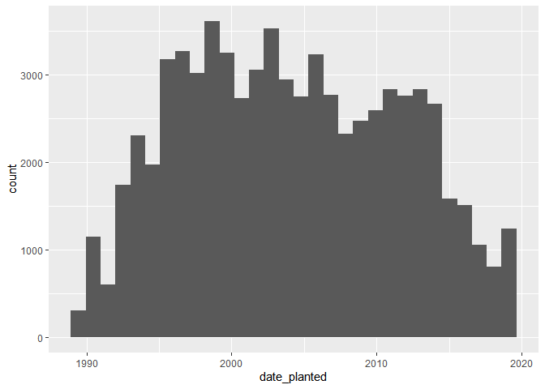
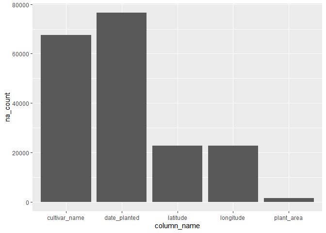
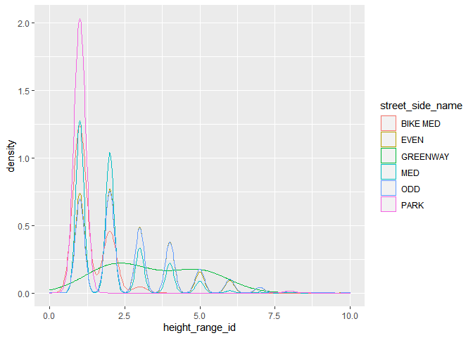

Mini Data-Analysis Deliverable 1
================
Yue Shen
2021/10/06

# Welcome to Yue Shen’s first-ever data analysis project!

1.  Install the [`datateachr`](https://github.com/UBC-MDS/datateachr)
    package by typing the following into your **R terminal**:

<!-- -->

    #11install.packages("devtools")
    devtools::install_github("UBC-MDS/datateachr")

2.  Load the packages below.

``` r
library(datateachr)
library(tidyverse)
```

    ## -- Attaching packages --------------------------------------- tidyverse 1.3.1 --

    ## v ggplot2 3.3.5     v purrr   0.3.4
    ## v tibble  3.1.4     v dplyr   1.0.7
    ## v tidyr   1.1.4     v stringr 1.4.0
    ## v readr   2.0.2     v forcats 0.5.1

    ## -- Conflicts ------------------------------------------ tidyverse_conflicts() --
    ## x dplyr::filter() masks stats::filter()
    ## x dplyr::lag()    masks stats::lag()

# Learning Objectives

-   Become familiar with your dataset of choosing
-   Think of 4 questions that you would like to answer with your data
-   Generate a reproducible and clear report using R Markdown

# Task 1: Choose your favorite dataset (10 points)

1.1 Out of the 7 datasets available in the `datateachr` package, choose
**4** that appeal to you based on their description. Write your choices
below:

1: cancer_sample  
2: flow_sample  
3: steam_games  
4: vancouver_trees

1.2 One way to narrowing down your selection is to *explore* the
datasets. Use your knowledge of dplyr to find out at least *3*
attributes about each of these datasets (an attribute is something such
as number of rows, variables, class type…). The goal here is to have an
idea of *what the data looks like*.

To explore those datasets, I use some of the functions below to print
relative informations: - function `class()` to find out the class type
of dataset. - function `glimpse()` to explore the number of rows, cols
and some details of data content. - function `dim()` to print the number
of rows and cols. - function `variable.names()` to find out all
variables’ name of dataset. - function `head()` to print the first 6
lines of data.

### cancer_sample

``` r
class(cancer_sample)
```

    ## [1] "spec_tbl_df" "tbl_df"      "tbl"         "data.frame"

``` r
glimpse(cancer_sample)
```

    ## Rows: 569
    ## Columns: 32
    ## $ ID                      <dbl> 842302, 842517, 84300903, 84348301, 84358402, ~
    ## $ diagnosis               <chr> "M", "M", "M", "M", "M", "M", "M", "M", "M", "~
    ## $ radius_mean             <dbl> 17.990, 20.570, 19.690, 11.420, 20.290, 12.450~
    ## $ texture_mean            <dbl> 10.38, 17.77, 21.25, 20.38, 14.34, 15.70, 19.9~
    ## $ perimeter_mean          <dbl> 122.80, 132.90, 130.00, 77.58, 135.10, 82.57, ~
    ## $ area_mean               <dbl> 1001.0, 1326.0, 1203.0, 386.1, 1297.0, 477.1, ~
    ## $ smoothness_mean         <dbl> 0.11840, 0.08474, 0.10960, 0.14250, 0.10030, 0~
    ## $ compactness_mean        <dbl> 0.27760, 0.07864, 0.15990, 0.28390, 0.13280, 0~
    ## $ concavity_mean          <dbl> 0.30010, 0.08690, 0.19740, 0.24140, 0.19800, 0~
    ## $ concave_points_mean     <dbl> 0.14710, 0.07017, 0.12790, 0.10520, 0.10430, 0~
    ## $ symmetry_mean           <dbl> 0.2419, 0.1812, 0.2069, 0.2597, 0.1809, 0.2087~
    ## $ fractal_dimension_mean  <dbl> 0.07871, 0.05667, 0.05999, 0.09744, 0.05883, 0~
    ## $ radius_se               <dbl> 1.0950, 0.5435, 0.7456, 0.4956, 0.7572, 0.3345~
    ## $ texture_se              <dbl> 0.9053, 0.7339, 0.7869, 1.1560, 0.7813, 0.8902~
    ## $ perimeter_se            <dbl> 8.589, 3.398, 4.585, 3.445, 5.438, 2.217, 3.18~
    ## $ area_se                 <dbl> 153.40, 74.08, 94.03, 27.23, 94.44, 27.19, 53.~
    ## $ smoothness_se           <dbl> 0.006399, 0.005225, 0.006150, 0.009110, 0.0114~
    ## $ compactness_se          <dbl> 0.049040, 0.013080, 0.040060, 0.074580, 0.0246~
    ## $ concavity_se            <dbl> 0.05373, 0.01860, 0.03832, 0.05661, 0.05688, 0~
    ## $ concave_points_se       <dbl> 0.015870, 0.013400, 0.020580, 0.018670, 0.0188~
    ## $ symmetry_se             <dbl> 0.03003, 0.01389, 0.02250, 0.05963, 0.01756, 0~
    ## $ fractal_dimension_se    <dbl> 0.006193, 0.003532, 0.004571, 0.009208, 0.0051~
    ## $ radius_worst            <dbl> 25.38, 24.99, 23.57, 14.91, 22.54, 15.47, 22.8~
    ## $ texture_worst           <dbl> 17.33, 23.41, 25.53, 26.50, 16.67, 23.75, 27.6~
    ## $ perimeter_worst         <dbl> 184.60, 158.80, 152.50, 98.87, 152.20, 103.40,~
    ## $ area_worst              <dbl> 2019.0, 1956.0, 1709.0, 567.7, 1575.0, 741.6, ~
    ## $ smoothness_worst        <dbl> 0.1622, 0.1238, 0.1444, 0.2098, 0.1374, 0.1791~
    ## $ compactness_worst       <dbl> 0.6656, 0.1866, 0.4245, 0.8663, 0.2050, 0.5249~
    ## $ concavity_worst         <dbl> 0.71190, 0.24160, 0.45040, 0.68690, 0.40000, 0~
    ## $ concave_points_worst    <dbl> 0.26540, 0.18600, 0.24300, 0.25750, 0.16250, 0~
    ## $ symmetry_worst          <dbl> 0.4601, 0.2750, 0.3613, 0.6638, 0.2364, 0.3985~
    ## $ fractal_dimension_worst <dbl> 0.11890, 0.08902, 0.08758, 0.17300, 0.07678, 0~

### flow_sample

``` r
class(flow_sample)
```

    ## [1] "tbl_df"     "tbl"        "data.frame"

``` r
dim(flow_sample)
```

    ## [1] 218   7

``` r
head(flow_sample)
```

    ## # A tibble: 6 x 7
    ##   station_id  year extreme_type month   day  flow sym  
    ##   <chr>      <dbl> <chr>        <dbl> <dbl> <dbl> <chr>
    ## 1 05BB001     1909 maximum          7     7   314 <NA> 
    ## 2 05BB001     1910 maximum          6    12   230 <NA> 
    ## 3 05BB001     1911 maximum          6    14   264 <NA> 
    ## 4 05BB001     1912 maximum          8    25   174 <NA> 
    ## 5 05BB001     1913 maximum          6    11   232 <NA> 
    ## 6 05BB001     1914 maximum          6    18   214 <NA>

### steam_games

``` r
class(steam_games)
```

    ## [1] "spec_tbl_df" "tbl_df"      "tbl"         "data.frame"

``` r
dim(steam_games)
```

    ## [1] 40833    21

``` r
variable.names(steam_games)
```

    ##  [1] "id"                       "url"                     
    ##  [3] "types"                    "name"                    
    ##  [5] "desc_snippet"             "recent_reviews"          
    ##  [7] "all_reviews"              "release_date"            
    ##  [9] "developer"                "publisher"               
    ## [11] "popular_tags"             "game_details"            
    ## [13] "languages"                "achievements"            
    ## [15] "genre"                    "game_description"        
    ## [17] "mature_content"           "minimum_requirements"    
    ## [19] "recommended_requirements" "original_price"          
    ## [21] "discount_price"

``` r
steam_games
```

    ## # A tibble: 40,833 x 21
    ##       id url    types name  desc_snippet recent_reviews all_reviews release_date
    ##    <dbl> <chr>  <chr> <chr> <chr>        <chr>          <chr>       <chr>       
    ##  1     1 https~ app   DOOM  Now include~ Very Positive~ Very Posit~ May 12, 2016
    ##  2     2 https~ app   PLAY~ PLAYERUNKNO~ Mixed,(6,214)~ Mixed,(836~ Dec 21, 2017
    ##  3     3 https~ app   BATT~ Take comman~ Mixed,(166),-~ Mostly Pos~ Apr 24, 2018
    ##  4     4 https~ app   DayZ  The post-so~ Mixed,(932),-~ Mixed,(167~ Dec 13, 2018
    ##  5     5 https~ app   EVE ~ EVE Online ~ Mixed,(287),-~ Mostly Pos~ May 6, 2003 
    ##  6     6 https~ bund~ Gran~ Grand Theft~ NaN            NaN         NaN         
    ##  7     7 https~ app   Devi~ The ultimat~ Very Positive~ Very Posit~ Mar 7, 2019 
    ##  8     8 https~ app   Huma~ Human: Fall~ Very Positive~ Very Posit~ Jul 22, 2016
    ##  9     9 https~ app   They~ They Are Bi~ Very Positive~ Very Posit~ Dec 12, 2017
    ## 10    10 https~ app   Warh~ In a world ~ <NA>           Mixed,(904~ May 31, 2019
    ## # ... with 40,823 more rows, and 13 more variables: developer <chr>,
    ## #   publisher <chr>, popular_tags <chr>, game_details <chr>, languages <chr>,
    ## #   achievements <dbl>, genre <chr>, game_description <chr>,
    ## #   mature_content <chr>, minimum_requirements <chr>,
    ## #   recommended_requirements <chr>, original_price <dbl>, discount_price <dbl>

### vancouver_trees

``` r
class(vancouver_trees)
```

    ## [1] "tbl_df"     "tbl"        "data.frame"

``` r
dim(vancouver_trees)
```

    ## [1] 146611     20

``` r
vancouver_trees
```

    ## # A tibble: 146,611 x 20
    ##    tree_id civic_number std_street    genus_name species_name cultivar_name  
    ##      <dbl>        <dbl> <chr>         <chr>      <chr>        <chr>          
    ##  1  149556          494 W 58TH AV     ULMUS      AMERICANA    BRANDON        
    ##  2  149563          450 W 58TH AV     ZELKOVA    SERRATA      <NA>           
    ##  3  149579         4994 WINDSOR ST    STYRAX     JAPONICA     <NA>           
    ##  4  149590          858 E 39TH AV     FRAXINUS   AMERICANA    AUTUMN APPLAUSE
    ##  5  149604         5032 WINDSOR ST    ACER       CAMPESTRE    <NA>           
    ##  6  149616          585 W 61ST AV     PYRUS      CALLERYANA   CHANTICLEER    
    ##  7  149617         4909 SHERBROOKE ST ACER       PLATANOIDES  COLUMNARE      
    ##  8  149618         4925 SHERBROOKE ST ACER       PLATANOIDES  COLUMNARE      
    ##  9  149619         4969 SHERBROOKE ST ACER       PLATANOIDES  COLUMNARE      
    ## 10  149625          720 E 39TH AV     FRAXINUS   AMERICANA    AUTUMN APPLAUSE
    ## # ... with 146,601 more rows, and 14 more variables: common_name <chr>,
    ## #   assigned <chr>, root_barrier <chr>, plant_area <chr>,
    ## #   on_street_block <dbl>, on_street <chr>, neighbourhood_name <chr>,
    ## #   street_side_name <chr>, height_range_id <dbl>, diameter <dbl>, curb <chr>,
    ## #   date_planted <date>, longitude <dbl>, latitude <dbl>

1.3 Now that you’ve explored the 4 datasets that you were initially most
interested in, let’s narrow it down to 2. What lead you to choose these
2? Briefly explain your choices below, and feel free to include any code
in your explanation.

My choices of 2 : `steam_games` and `vancouver_trees`, here are the
reasons below: - For dataset `cancer_sample`, I found that most of the
variables’ datatype are numbers and only contain one string type. Since
I want to have more variables with different kinds of datatype , I
didn’t choose `cancer_sample` - For dataset `flow_sample`, it only has 7
columns and one of them are all `N/A` value, hence I feel it couldn’t
provide me enough data points to do my analysis.

1.4 Time for the final decision! Going back to the beginning, it’s
important to have an *end goal* in mind. For example, if I had chosen
the `titanic` dataset for my project, I might’ve wanted to explore the
relationship between survival and other variables. Try to think of 1
research question that you would want to answer with each dataset. Note
them down below, and make your final choice based on what seems more
interesting to you!

For dataset `vancouver_trees`, my research question is “how many trees
are there for each street block”? For dataset `steam_games`, my research
question is “I want to figure out all steam games with very positive
reviews and order them by the total number of reviews”.

Since later I found out that the reviews in the `steam_games` are mixed
with numbers and level of reviews represented as strings, I don’t feel
it’s convenient to do this kind of research.

Hence my final choice is `vancouver_trees`

# Task 2: Exploring your dataset (15 points)

2.1 Complete *4 out of the following 8 exercises* to dive deeper into
your data. All datasets are different and therefore, not all of these
tasks may make sense for your data - which is why you should only answer
*4*. Use *dplyr* and *ggplot*.

1.  Plot the distribution of a numeric variable.
2.  Create a new variable based on other variables in your data (only if
    it makes sense)
3.  Investigate how many missing values there are per variable. Can you
    find a way to plot this?
4.  Explore the relationship between 2 variables in a plot.
5.  Filter observations in your data according to your own criteria.
    Think of what you’d like to explore - again, if this was the
    `titanic` dataset, I may want to narrow my search down to passengers
    born in a particular year…
6.  Use a boxplot to look at the frequency of different observations
    within a single variable. You can do this for more than one variable
    if you wish!
7.  Make a new tibble with a subset of your data, with variables and
    observations that you are interested in exploring.
8.  Use a density plot to explore any of your variables (that are
    suitable for this type of plot).

2.2 For each of the 4 exercises that you complete, provide a *brief
explanation* of why you chose that exercise in relation to your data (in
other words, why does it make sense to do that?), and sufficient
comments for a reader to understand your reasoning and code.

# Task 3: Write your research questions (5 points)

So far, you have chosen a dataset and gotten familiar with it through
exploring the data. Now it’s time to figure out 4 research questions
that you would like to answer with your data! Write the 4 questions and
any additional comments at the end of this deliverable. These questions
are not necessarily set in stone - TAs will review them and give you
feedback; therefore, you may choose to pursue them as they are for the
rest of the project, or make modifications!

<!--- *****START HERE***** --->

## 1. Plot the distribution of a numeric variable

I want to know the tendency of how many trees are planted during those
years, hence I plot the distributions of variable `date_planted`. As we
can see in the figure plotted, most of the trees are planted between
year 1995 to 2015.

``` r
exercise1 <- ggplot(vancouver_trees, aes(date_planted)) +
   geom_histogram(bins = 30)
print(exercise1)
```

    ## Warning: Removed 76548 rows containing non-finite values (stat_bin).

<!-- -->

## 2. Create a new variable based on other variables in your data

I noticed there is a variable `diameter` in the dataset and with unit
“meter”, hence I decide to create another variable named `radius_cm`
whose unit is “centimeter”. When showing the new data, I select them in
the order of `tree_id`, `diameter`, `radius_cm` and everything else in
the dataset.

``` r
exercise2 <- vancouver_trees %>%
    mutate(radius_cm = diameter/2 * 100) %>%
    select(tree_id, diameter, radius_cm, everything())
head(exercise2)
```

    ## # A tibble: 6 x 21
    ##   tree_id diameter radius_cm civic_number std_street genus_name species_name
    ##     <dbl>    <dbl>     <dbl>        <dbl> <chr>      <chr>      <chr>       
    ## 1  149556       10       500          494 W 58TH AV  ULMUS      AMERICANA   
    ## 2  149563       10       500          450 W 58TH AV  ZELKOVA    SERRATA     
    ## 3  149579        4       200         4994 WINDSOR ST STYRAX     JAPONICA    
    ## 4  149590       18       900          858 E 39TH AV  FRAXINUS   AMERICANA   
    ## 5  149604        9       450         5032 WINDSOR ST ACER       CAMPESTRE   
    ## 6  149616        5       250          585 W 61ST AV  PYRUS      CALLERYANA  
    ## # ... with 14 more variables: cultivar_name <chr>, common_name <chr>,
    ## #   assigned <chr>, root_barrier <chr>, plant_area <chr>,
    ## #   on_street_block <dbl>, on_street <chr>, neighbourhood_name <chr>,
    ## #   street_side_name <chr>, height_range_id <dbl>, curb <chr>,
    ## #   date_planted <date>, longitude <dbl>, latitude <dbl>

## 3. Investigate how many missing values there are per variable. Can you find a way to plot this?

When exporing the dataset `vancouver_trees`, I found there were some
missing values in several columns like cultivar_name, date_planted,
longitude and latitude. I think it would be interesting and useful to
find out the count of missing values for each column.

The following lines of code generate a dataframe that shows the column
name and its count of missing values. In order to plot the data frame
generated, I joined the unamed row names to the dataframe.

``` r
na_count <- sapply(vancouver_trees, function(x) sum(length(which(is.na(x)))))
na_count <- data.frame(na_count) %>%  filter(na_count != 0)
na_count <- cbind(rownames(na_count), na_count)
names(na_count)[1] <- paste("column_name")
na_count
```

    ##                 column_name na_count
    ## cultivar_name cultivar_name    67559
    ## plant_area       plant_area     1486
    ## date_planted   date_planted    76548
    ## longitude         longitude    22771
    ## latitude           latitude    22771

After getting the dataframe above, I use `ggplot` and `geom_col()` to
plot the bar chat.

``` r
exercise3 <- ggplot(na_count, aes(column_name, na_count)) +
   geom_col()
print(exercise3)
```

<!-- -->

## 8. Use a density plot to explore any of your variables

I want to figure out for different kinds of street side, what’s the
density of tree’s height range id. The following lines of code plot the
figure, which distinguishs street side by color.

``` r
exercise8  <- ggplot(vancouver_trees, aes(height_range_id)) + 
    geom_density(aes(color = street_side_name))
print(exercise8)
```

<!-- -->

## My Four Research Questions

-   How many trees are planted in different street?
    -   Does a particular street have more trees than others?
-   what’s the relationship between latitude and species of trees
    -   Are trees with a specific same species planted in a range of
        latitude?
-   What’s the relationship between tree’s diameter and its genus?
    -   Are trees with a specific same genus have longer diameter?
-   What’s the relationship between date_planted and neighbourhood_name?
    -   For different neighbourhood, what range of years have the
        highest frequency of planting trees?
