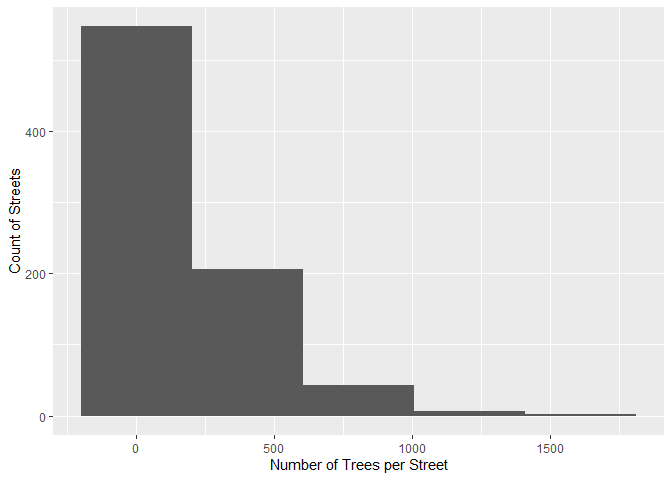
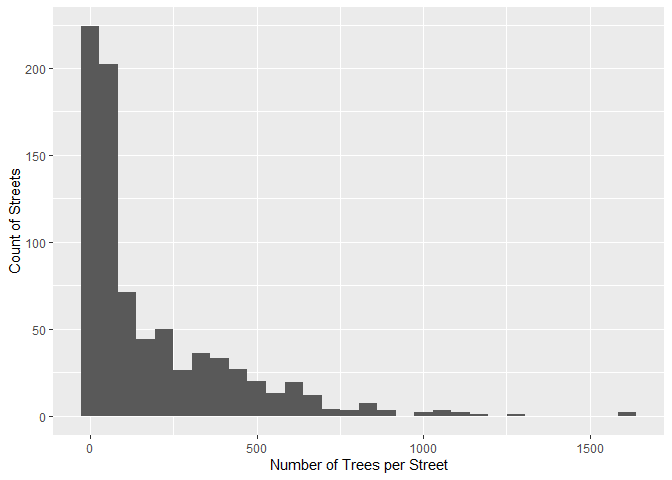
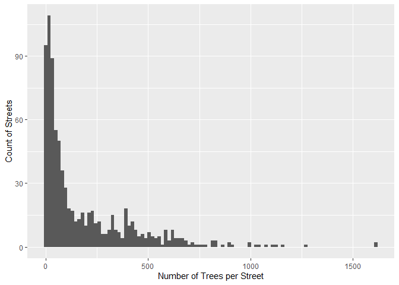
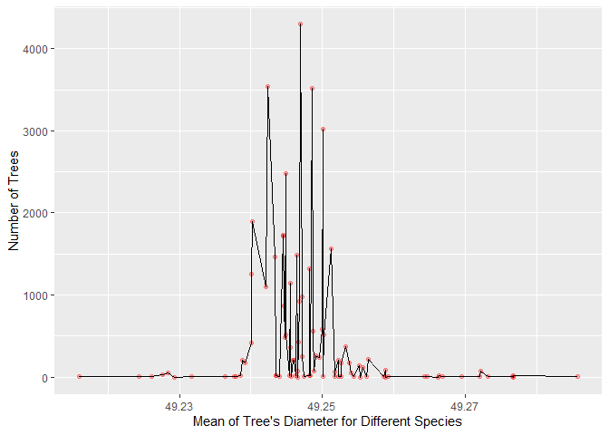
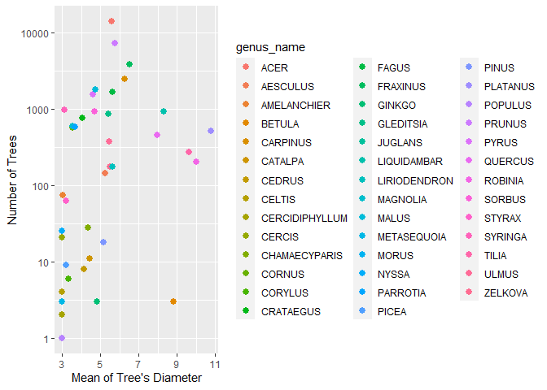
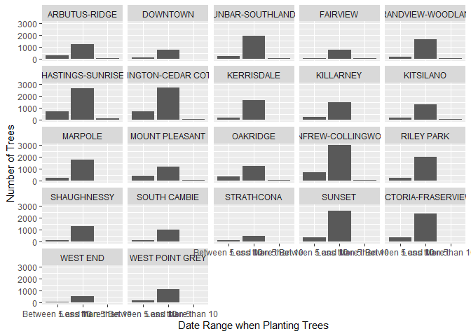

Mini Data-Analysis Deliverable 2
================
Yue Shen
2021/10/17

# Welcome back to Yue Shen’s mini data analysis project!

Begin by loading your data and the tidyverse package below:

``` r
suppressPackageStartupMessages(library(datateachr))
suppressPackageStartupMessages(library(tidyverse))
```

# Learning Objectives

By the end of this milestone, you should:

-   Become familiar with manipulating and summarizing your data in
    tibbles using `dplyr`, with a research question in mind
-   Understand what *tidy* data is, and how to create it. In milestone
    3, we will explore when this might be useful
-   Generate a reproducible and clear report using R Markdown
-   Gain a greater understanding of how to use R to answer research
    questions about your data

# Task 1: Process and summarize your data (15 points)

### 1.1 (2.5 points)

First, write out the 4 research questions you defined in milestone 1
were. This will guide your work through milestone 2:

<!-------------------------- Start your work below ---------------------------->

1.  Does a particular street have more trees than others?

2.  Are trees with a specific same species planted in a range of
    latitude?

3.  Are trees with a specific same genus have longer diameter?

4.  For different neighbourhood, what range of years have the highest
    frequency of planting trees?

<!----------------------------------------------------------------------------->

### 1.2 (10 points)

Now, for each of your four research questions, choose one task from
options 1-4 (summarizing), and one other task from 4-8 (graphing). You
should have 2 tasks done for each research question (8 total). Make sure
it makes sense to do them! (e.g. don’t use a numerical variables for a
task that needs a categorical variable.). Comment on why each task helps
(or doesn’t!) answer the corresponding research question.

Ensure that the output of each operation is printed!

**Summarizing:**

1.  Compute the *range*, *mean*, and *two other summary statistics* of
    **one numerical variable** across the groups of **one categorical
    variable** from your data.
2.  Compute the number of observations for at least one of your
    categorical variables. Do not use the function `table()`!
3.  Create a categorical variable with 3 or more groups from an existing
    numerical variable. You can use this new variable in the other
    tasks! *An example: age in years into “child, teen, adult, senior”.*
4.  Based on two categorical variables, calculate two summary statistics
    of your choosing.

**Graphing:**

5.  Create a graph out of summarized variables that has at least two
    geom layers.
6.  Create a graph of your choosing, make one of the axes logarithmic,
    and format the axes labels so that they are “pretty” or easier to
    read.
7.  Make a graph where it makes sense to customize the alpha
    transparency.
8.  Create 3 histograms out of summarized variables, with each histogram
    having different sized bins. Pick the “best” one and explain why it
    is the best.

Make sure it’s clear what research question you are doing each operation
for!

<!------------------------- Start your work below ----------------------------->

#### 1. Does a particular street have more trees than others?

**Summarizing:**

Choose 2: I computed the number of observations for categorical
variables `std_street` and arrange them in a descending order.

``` r
RQ1_Summarize  <- vancouver_trees %>% group_by(std_street) %>% summarize(tree_count = n()) %>% arrange(desc(tree_count))
RQ1_Summarize
```

    ## # A tibble: 805 x 2
    ##    std_street       tree_count
    ##    <chr>                 <int>
    ##  1 W KING EDWARD AV       1614
    ##  2 CAMBIE ST              1610
    ##  3 W 13TH AV              1264
    ##  4 W 16TH AV              1157
    ##  5 W 14TH AV              1124
    ##  6 W 15TH AV              1100
    ##  7 MAIN ST                1068
    ##  8 W 12TH AV              1047
    ##  9 W 37TH AV              1030
    ## 10 NANAIMO ST             1001
    ## # ... with 795 more rows

**Graphing:**

Choose 8: I created 3 histograms out of the summarized variables which
shows number of tree in different streets. For 3 histograms, I set the
bar size 5, 30 and 100 respectively.

``` r
RQ1_Graph <- ggplot(RQ1_Summarize, aes(tree_count)) +
   geom_histogram(bins = 5) +
   xlab("Number of Trees per Street") +
   ylab("Count of Streets")
print(RQ1_Graph)
```

<!-- -->

``` r
RQ1_Graph <- ggplot(RQ1_Summarize, aes(tree_count)) +
   geom_histogram(bins = 30) +
   xlab("Number of Trees per Street") +
   ylab("Count of Streets")
print(RQ1_Graph)
```

<!-- -->

``` r
RQ1_Graph <- ggplot(RQ1_Summarize, aes(tree_count)) +
   geom_histogram(bins = 100) +
   xlab("Number of Trees per Street") +
   ylab("Count of Streets")
print(RQ1_Graph)
```

<!-- -->

I personally think the third histogram with bar size 100 is the “best”
one, because we could clearly see that there are only 2 streets with
more than 1500 trees, and few streets have more than 1000 trees. The
majority of the streets own trees with less than the number of 500.

However, since there exists a large amount of different street, the bars
with small size will be hard to distinguished.

#### 2. Are trees with a specific same species planted in a range of latitude?

**Summarizing:**

Choose 1: I computed the *range*, *mean*, *median*, and *count* of trees
across the groups of `species_name`, and arrange them in the ascending
order of range, mean and count.

``` r
RQ2_Summarize  <- vancouver_trees %>% group_by(species_name) %>% drop_na() %>% 
        summarise(min_latitude = min(latitude), max_latitude = max(latitude), range = max_latitude - min_latitude,
                  mean = mean(latitude, na.rm = TRUE), 
                  median = median(latitude, na.rm = TRUE), count  = n()) %>% 
                  arrange(range, mean, count) 
RQ2_Summarize
```

    ## # A tibble: 89 x 7
    ##    species_name min_latitude max_latitude     range  mean median count
    ##    <chr>               <dbl>        <dbl>     <dbl> <dbl>  <dbl> <int>
    ##  1 TREMULA              49.2         49.2 0          49.2   49.2     1
    ##  2 GRIFFITHII           49.2         49.2 0          49.2   49.2     1
    ##  3 ALBA                 49.3         49.3 0          49.3   49.3     1
    ##  4 REGIA                49.3         49.3 0          49.3   49.3     1
    ##  5 AVIUM                49.3         49.3 0          49.3   49.3     1
    ##  6 COMMUNIS             49.3         49.3 0          49.3   49.3     1
    ##  7 PARVIFLORA           49.3         49.3 0.0000170  49.3   49.3     3
    ##  8 BIGNONIOIDES         49.3         49.3 0.0000500  49.3   49.3     5
    ##  9 JAPONICUM            49.2         49.2 0.0000780  49.2   49.2     2
    ## 10 SWEETHEART           49.3         49.3 0.000100   49.3   49.3     5
    ## # ... with 79 more rows

**Graphing:**

Choose 5 and 7: I created a graph out of summarized variables *mean* of
latitude and trees’ *count* for each species. Also, it’s a plot with
multiple points, some of which have possible overlapping positions,
hence, I customized the alpha transparency to 0.3, and set point color
to red.

``` r
RQ2_Graph <- ggplot(RQ2_Summarize, aes(mean, count)) +
   geom_point(color = "red", alpha = 0.3) +
   geom_line() +
   xlab("Mean of Tree's Diameter for Different Species") +
   ylab("Number of Trees")
print(RQ2_Graph)
```

<!-- -->

#### 3. Are trees with a specific same genus have longer diameter?

**Summarizing:**

Choose 1: I computed the *range*, *mean*, and *count* of trees and
*count* of trees whose mean diameter is larger than 5, across the groups
of `genus_name`, and arrange them in the ascending order of mean and
count.

``` r
RQ3_Summarize  <- vancouver_trees %>% group_by(genus_name) %>% drop_na() %>% 
        summarise(min_diameter = min(diameter), max_diameter = max(diameter), range = max_diameter - min_diameter,
                  mean_diameter = mean(diameter, na.rm = TRUE), 
                  tree_count  = n(), tree_count_5 = sum(diameter >= 5)) %>% 
                  arrange(mean_diameter, tree_count)
RQ3_Summarize
```

    ## # A tibble: 41 x 7
    ##    genus_name     min_diameter max_diameter range mean_diameter tree_count
    ##    <chr>                 <dbl>        <dbl> <dbl>         <dbl>      <int>
    ##  1 JUGLANS                 3              3   0            3             1
    ##  2 MORUS                   3              3   0            3             1
    ##  3 POPULUS                 3              3   0            3             1
    ##  4 CERCIDIPHYLLUM          3              3   0            3             2
    ##  5 METASEQUOIA             3              3   0            3             3
    ##  6 CELTIS                  3              3   0            3             4
    ##  7 CERCIS                  3              3   0            3            21
    ##  8 NYSSA                   3              3   0            3            25
    ##  9 AMELANCHIER             3              4   1            3.02         75
    ## 10 SYRINGA                 0.5            8   7.5          3.11        973
    ## # ... with 31 more rows, and 1 more variable: tree_count_5 <int>

**Graphing:**

Choose 6: I created a graph with mean diameter as x-axis and count of
trees as y-axis. I made y-axis logarithmic, and formatted its label as
“Number of trees”. I also colored those points by genus name. Making
y-axis logarithmic helps those points become more scattered and
distinguishable.

``` r
RQ3_Graph <-  RQ3_Summarize %>% 
          ggplot(aes(mean_diameter, tree_count)) +
          geom_point(size = 2.5, aes(color = genus_name)) +
          xlab("Mean of Tree's Diameter") +
          scale_y_log10("Number of Trees")
print(RQ3_Graph)
```

<!-- -->

#### 4. For different neighbourhood, what range of years have the highest frequency of planting trees?

**Summarizing:**

Choose 3: I created a categorical variable`date_range` with 3 groups
from existing numerical variable `date_planted`.

-   If the tree is planted before 1991-11-1. then it should be planted
    for more than 10 years;

-   If the tree is planted before 1996-11-1. then it should be planted
    for more than 5 years but less than 10 years;

-   If the tree is planted before 2021-11-1. then it should be planted
    for less than 5 years;

``` r
RQ4_Summarize  <- vancouver_trees %>% mutate(date_range = case_when(
                               date_planted <= "1991-11-1" ~ "More than 10", 
                               date_planted <= "1996-11-1" ~ "Between 5 and 10",
                               date_planted <= "2021-11-1" ~ "Less than 5")) %>%
                 select(tree_id, date_planted, date_range, everything()) %>% drop_na()
RQ4_Summarize
```

    ## # A tibble: 41,859 x 21
    ##    tree_id date_planted date_range       civic_number std_street    genus_name
    ##      <dbl> <date>       <chr>                   <dbl> <chr>         <chr>     
    ##  1  149556 1999-01-13   Less than 5               494 W 58TH AV     ULMUS     
    ##  2  149590 1996-04-29   Between 5 and 10          858 E 39TH AV     FRAXINUS  
    ##  3  149617 1993-12-16   Between 5 and 10         4909 SHERBROOKE ST ACER      
    ##  4  149618 1993-12-16   Between 5 and 10         4925 SHERBROOKE ST ACER      
    ##  5  149619 1993-12-16   Between 5 and 10         4969 SHERBROOKE ST ACER      
    ##  6  149625 1993-12-03   Between 5 and 10          720 E 39TH AV     FRAXINUS  
    ##  7  149640 1993-12-15   Between 5 and 10         6968 SELKIRK ST    ACER      
    ##  8  149673 1993-12-20   Between 5 and 10         5241 WINDSOR ST    FRAXINUS  
    ##  9  149683 1993-12-15   Between 5 and 10         7011 SELKIRK ST    ACER      
    ## 10  149684 1993-12-15   Between 5 and 10         1223 W 54TH AV     ACER      
    ## # ... with 41,849 more rows, and 15 more variables: species_name <chr>,
    ## #   cultivar_name <chr>, common_name <chr>, assigned <chr>, root_barrier <chr>,
    ## #   plant_area <chr>, on_street_block <dbl>, on_street <chr>,
    ## #   neighbourhood_name <chr>, street_side_name <chr>, height_range_id <dbl>,
    ## #   diameter <dbl>, curb <chr>, longitude <dbl>, latitude <dbl>

After adding the new column `date_range`, I calculated the tree count
based on it and another categorical variables `neighbourhood_name`.

``` r
RQ4_Summarize2 <- RQ4_Summarize %>% group_by(neighbourhood_name, date_range) %>% 
             summarise(tree_count = n(), .groups = 'drop') %>%
             arrange(neighbourhood_name, tree_count)
RQ4_Summarize2
```

    ## # A tibble: 65 x 3
    ##    neighbourhood_name date_range       tree_count
    ##    <chr>              <chr>                 <int>
    ##  1 ARBUTUS-RIDGE      More than 10             59
    ##  2 ARBUTUS-RIDGE      Between 5 and 10        277
    ##  3 ARBUTUS-RIDGE      Less than 5            1250
    ##  4 DOWNTOWN           More than 10              5
    ##  5 DOWNTOWN           Between 5 and 10        112
    ##  6 DOWNTOWN           Less than 5             747
    ##  7 DUNBAR-SOUTHLANDS  More than 10             88
    ##  8 DUNBAR-SOUTHLANDS  Between 5 and 10        237
    ##  9 DUNBAR-SOUTHLANDS  Less than 5            1960
    ## 10 FAIRVIEW           More than 10             34
    ## # ... with 55 more rows

**Graphing:**

Choose 5: I created a graph out of summarized variables *date_range* and
trees’ *count* in each neighbourhood. Also, I used facetting to
distinguish the plot by neighbourhood.

``` r
RQ4_Graph <- RQ4_Summarize2 %>%
          ggplot(aes(date_range, tree_count)) +
          facet_wrap(~ neighbourhood_name) +
          geom_col() +
          xlab("Date Range when Planting Trees") +
          ylab("Number of Trees")
print(RQ4_Graph)
```

<!-- -->

<!----------------------------------------------------------------------------->

### 1.3 (2.5 points)

Based on the operations that you’ve completed, how much closer are you
to answering your research questions? Think about what aspects of your
research questions remain unclear. Can your research questions be
refined, now that you’ve investigated your data a bit more? Which
research questions are yielding interesting results?

<!------------------------- Write your answer here ---------------------------->

**RQ1:** I think I mostly figure out what I want to know. I found the
street with most trees! Even though there are too many streets to draw a
more clear graph, it still tells us that there are only 2 streets with
more than 1500 trees, and few streets have more than 1000 trees. The
majority of the streets own trees with less than the number of 500.

**RQ2:** I don’t think the relationship between latitude and tree’s
species is clear, since the dataset contains trees only in Vancouver,
the range of latitude is not big. I can only see that some of the
species in Vancouver is very rare.

**RQ3:** The results are interesting. We can clearly see that the trees
with some of genus have longer diameter, like “ROBINIA” and “PLATANUS”.

**RQ4:** From the research above, We can see that most of the
neighbourhoods have the majority trees planted during the recent 5
years.

However, I couldn’t distinguish the frequency of planting trees in
different neighbourhood clearly, because I only splitted the
`date_planted` into 3 groups.

For future investigation, maybe the research question can be refined as
“What’s the trend of count of trees planted for different neighborhood
during the past year?”

<!----------------------------------------------------------------------------->

# Task 2: Tidy your data (12.5 points)

In this task, we will do several exercises to reshape our data. The goal
here is to understand how to do this reshaping with the `tidyr` package.

A reminder of the definition of *tidy* data:

-   Each row is an **observation**
-   Each column is a **variable**
-   Each cell is a **value**

*Tidy’ing* data is sometimes necessary because it can simplify
computation. Other times it can be nice to organize data so that it can
be easier to understand when read manually.

### 2.1 (2.5 points)

Based on the definition above, can you identify if your data is tidy or
untidy? Go through all your columns, or if you have \>8 variables, just
pick 8, and explain whether the data is untidy or tidy.

<!--------------------------- Start your work below --------------------------->

``` r
my_vancouver_trees <- vancouver_trees %>% select(tree_id, std_street, genus_name, species_name, neighbourhood_name, diameter, date_planted, latitude)
my_vancouver_trees
```

    ## # A tibble: 146,611 x 8
    ##    tree_id std_street    genus_name species_name neighbourhood_name     diameter
    ##      <dbl> <chr>         <chr>      <chr>        <chr>                     <dbl>
    ##  1  149556 W 58TH AV     ULMUS      AMERICANA    MARPOLE                    10  
    ##  2  149563 W 58TH AV     ZELKOVA    SERRATA      MARPOLE                    10  
    ##  3  149579 WINDSOR ST    STYRAX     JAPONICA     KENSINGTON-CEDAR COTT~      4  
    ##  4  149590 E 39TH AV     FRAXINUS   AMERICANA    KENSINGTON-CEDAR COTT~     18  
    ##  5  149604 WINDSOR ST    ACER       CAMPESTRE    KENSINGTON-CEDAR COTT~      9  
    ##  6  149616 W 61ST AV     PYRUS      CALLERYANA   MARPOLE                     5  
    ##  7  149617 SHERBROOKE ST ACER       PLATANOIDES  KENSINGTON-CEDAR COTT~     15  
    ##  8  149618 SHERBROOKE ST ACER       PLATANOIDES  KENSINGTON-CEDAR COTT~     14  
    ##  9  149619 SHERBROOKE ST ACER       PLATANOIDES  KENSINGTON-CEDAR COTT~     16  
    ## 10  149625 E 39TH AV     FRAXINUS   AMERICANA    KENSINGTON-CEDAR COTT~      7.5
    ## # ... with 146,601 more rows, and 2 more variables: date_planted <date>,
    ## #   latitude <dbl>

I picked 8 variables that I’ve used. The data is tidy because it
satisfies the three conditions above:

-   Each row is an observation of one tree.

-   Each column is a variable which describes one characteristic of
    tree. Different trees have different id, locations, genus,
    diameter……

-   Each cell shows an exact value of that tree.

<!----------------------------------------------------------------------------->

### 2.2 (5 points)

Now, if your data is tidy, untidy it! Then, tidy it back to it’s
original state.

If your data is untidy, then tidy it! Then, untidy it back to it’s
original state.

Be sure to explain your reasoning for this task. Show us the “before”
and “after”.

<!--------------------------- Start your work below --------------------------->

### Before - the data is tidy

``` r
my_vancouver_trees
```

    ## # A tibble: 146,611 x 8
    ##    tree_id std_street    genus_name species_name neighbourhood_name     diameter
    ##      <dbl> <chr>         <chr>      <chr>        <chr>                     <dbl>
    ##  1  149556 W 58TH AV     ULMUS      AMERICANA    MARPOLE                    10  
    ##  2  149563 W 58TH AV     ZELKOVA    SERRATA      MARPOLE                    10  
    ##  3  149579 WINDSOR ST    STYRAX     JAPONICA     KENSINGTON-CEDAR COTT~      4  
    ##  4  149590 E 39TH AV     FRAXINUS   AMERICANA    KENSINGTON-CEDAR COTT~     18  
    ##  5  149604 WINDSOR ST    ACER       CAMPESTRE    KENSINGTON-CEDAR COTT~      9  
    ##  6  149616 W 61ST AV     PYRUS      CALLERYANA   MARPOLE                     5  
    ##  7  149617 SHERBROOKE ST ACER       PLATANOIDES  KENSINGTON-CEDAR COTT~     15  
    ##  8  149618 SHERBROOKE ST ACER       PLATANOIDES  KENSINGTON-CEDAR COTT~     14  
    ##  9  149619 SHERBROOKE ST ACER       PLATANOIDES  KENSINGTON-CEDAR COTT~     16  
    ## 10  149625 E 39TH AV     FRAXINUS   AMERICANA    KENSINGTON-CEDAR COTT~      7.5
    ## # ... with 146,601 more rows, and 2 more variables: date_planted <date>,
    ## #   latitude <dbl>

### Untidy my_vancouver_trees

``` r
untidy_vancouver_trees <- my_vancouver_trees %>%
    unite(col = "name", c(genus_name, species_name), sep = "_" )
untidy_vancouver_trees
```

    ## # A tibble: 146,611 x 7
    ##    tree_id std_street    name    neighbourhood_n~ diameter date_planted latitude
    ##      <dbl> <chr>         <chr>   <chr>               <dbl> <date>          <dbl>
    ##  1  149556 W 58TH AV     ULMUS_~ MARPOLE              10   1999-01-13       49.2
    ##  2  149563 W 58TH AV     ZELKOV~ MARPOLE              10   1996-05-31       49.2
    ##  3  149579 WINDSOR ST    STYRAX~ KENSINGTON-CEDA~      4   1993-11-22       49.2
    ##  4  149590 E 39TH AV     FRAXIN~ KENSINGTON-CEDA~     18   1996-04-29       49.2
    ##  5  149604 WINDSOR ST    ACER_C~ KENSINGTON-CEDA~      9   1993-12-17       49.2
    ##  6  149616 W 61ST AV     PYRUS_~ MARPOLE               5   NA               49.2
    ##  7  149617 SHERBROOKE ST ACER_P~ KENSINGTON-CEDA~     15   1993-12-16       49.2
    ##  8  149618 SHERBROOKE ST ACER_P~ KENSINGTON-CEDA~     14   1993-12-16       49.2
    ##  9  149619 SHERBROOKE ST ACER_P~ KENSINGTON-CEDA~     16   1993-12-16       49.2
    ## 10  149625 E 39TH AV     FRAXIN~ KENSINGTON-CEDA~      7.5 1993-12-03       49.2
    ## # ... with 146,601 more rows

I united `genus_name` and `species_name` into a new variable `name`
using `tidyr::unite()` and joined then with “\_“, which made the data
untidy because each cell contained more than one value.

### After - tidy back

``` r
tidy_vancouver_trees <- untidy_vancouver_trees %>%
    separate(name, into = c("genus_name", "species_name"), sep="_")
tidy_vancouver_trees
```

    ## # A tibble: 146,611 x 8
    ##    tree_id std_street    genus_name species_name neighbourhood_name     diameter
    ##      <dbl> <chr>         <chr>      <chr>        <chr>                     <dbl>
    ##  1  149556 W 58TH AV     ULMUS      AMERICANA    MARPOLE                    10  
    ##  2  149563 W 58TH AV     ZELKOVA    SERRATA      MARPOLE                    10  
    ##  3  149579 WINDSOR ST    STYRAX     JAPONICA     KENSINGTON-CEDAR COTT~      4  
    ##  4  149590 E 39TH AV     FRAXINUS   AMERICANA    KENSINGTON-CEDAR COTT~     18  
    ##  5  149604 WINDSOR ST    ACER       CAMPESTRE    KENSINGTON-CEDAR COTT~      9  
    ##  6  149616 W 61ST AV     PYRUS      CALLERYANA   MARPOLE                     5  
    ##  7  149617 SHERBROOKE ST ACER       PLATANOIDES  KENSINGTON-CEDAR COTT~     15  
    ##  8  149618 SHERBROOKE ST ACER       PLATANOIDES  KENSINGTON-CEDAR COTT~     14  
    ##  9  149619 SHERBROOKE ST ACER       PLATANOIDES  KENSINGTON-CEDAR COTT~     16  
    ## 10  149625 E 39TH AV     FRAXINUS   AMERICANA    KENSINGTON-CEDAR COTT~      7.5
    ## # ... with 146,601 more rows, and 2 more variables: date_planted <date>,
    ## #   latitude <dbl>

I used `tidyr::separate()` to split the `name` in
`untidy_vancouver_trees` back into the original two columns:
`genus_name` and `species_name`, making the data tidy again!

<!----------------------------------------------------------------------------->

### 2.3 (5 points)

Now, you should be more familiar with your data, and also have made
progress in answering your research questions. Based on your interest,
and your analyses, pick 2 of the 4 research questions to continue your
analysis in milestone 3, and explain your decision.

Try to choose a version of your data that you think will be appropriate
to answer these 2 questions in milestone 3. Use between 4 and 8
functions that we’ve covered so far (i.e. by filtering, cleaning,
tidy’ing, dropping irrelevant columns, etc.).

<!--------------------------- Start your work below --------------------------->

I want to choose question 3 and question 4 to continue my analysis.

-   Question 3: Are trees with a specific same genus have longer
    diameter?

-   Question 4: For different neighbourhood, what range of years have
    the highest frequency of planting trees? (Refined as: What’s the
    trend of count of trees planted for different neighborhood during
    the past year?“)

Explanation: For questin 3, It’s more valuable to dig into the tree’s
genus and their diameters, which may produce many interesting academic
findings.

Also, for question 4, we can add a new column into the dataframe, and
through analyzing this question, we can have a better understanding of
each neighborhood and its types of trees, which many people especially
residents may be interested in.

I used function `drop_na()` to drop irrelevant columns, function
`arrange` to sort the tree by its date planted, function `mutate` to add
a new column, function `rename` to rename the title of columns, and
function `select` to select the columns that I need.

``` r
new_vancouver_trees  <- vancouver_trees %>% 
                      drop_na() %>% 
                      arrange(date_planted) %>% 
                      mutate(date_range = case_when(
                               date_planted <= "1991-11-1" ~ "More than 10", 
                               date_planted <= "1996-11-1" ~ "Between 5 and 10",
                               date_planted <= "2021-11-1" ~ "Less than 5")) %>%
                      rename(genus = genus_name, species = species_name, 
                            neighbourhood = neighbourhood_name, street_side = street_side_name) %>%
                      select(tree_id, date_planted, date_range, std_street, genus, species, neighbourhood, street_side, height_range_id, diameter, longitude, latitude)
new_vancouver_trees
```

    ## # A tibble: 41,859 x 12
    ##    tree_id date_planted date_range   std_street genus  species    neighbourhood 
    ##      <dbl> <date>       <chr>        <chr>      <chr>  <chr>      <chr>         
    ##  1   30343 1989-11-02   More than 10 W 30TH AV  PRUNUS CERASIFERA DUNBAR-SOUTHL~
    ##  2   30356 1989-11-02   More than 10 W 30TH AV  PRUNUS CERASIFERA DUNBAR-SOUTHL~
    ##  3   30359 1989-11-02   More than 10 W 30TH AV  PRUNUS CERASIFERA DUNBAR-SOUTHL~
    ##  4  122030 1989-11-02   More than 10 W 30TH AV  PRUNUS CERASIFERA DUNBAR-SOUTHL~
    ##  5  122038 1989-11-02   More than 10 W 30TH AV  PRUNUS CERASIFERA DUNBAR-SOUTHL~
    ##  6  122046 1989-11-02   More than 10 DUNBAR ST  PRUNUS CERASIFERA DUNBAR-SOUTHL~
    ##  7   30353 1989-11-02   More than 10 W 30TH AV  PRUNUS CERASIFERA DUNBAR-SOUTHL~
    ##  8   30358 1989-11-02   More than 10 W 30TH AV  PRUNUS CERASIFERA DUNBAR-SOUTHL~
    ##  9   30369 1989-11-02   More than 10 W 30TH AV  PRUNUS CERASIFERA DUNBAR-SOUTHL~
    ## 10  122031 1989-11-02   More than 10 W 30TH AV  PRUNUS CERASIFERA DUNBAR-SOUTHL~
    ## # ... with 41,849 more rows, and 5 more variables: street_side <chr>,
    ## #   height_range_id <dbl>, diameter <dbl>, longitude <dbl>, latitude <dbl>

I used function `saveRDS()` to save the new dataframe as an `.RDS` file.

``` r
saveRDS(new_vancouver_trees,file="new_vancouver_trees")
```

<!----------------------------------------------------------------------------->

*When you are done, knit an `md` file. This is what we will mark! Make
sure to open it and check that everything has knitted correctly before
submitting your tagged release.*

### Attribution

Thanks to Victor Yuan for mostly putting this together.
