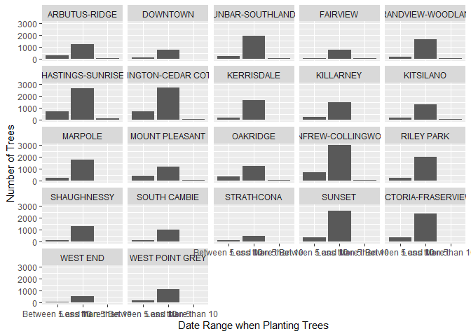
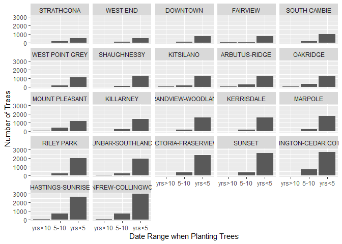

Mini Data-Analysis Deliverable 3
================
Yue Shen
2021/10/26

# Welcome to Yue Shen’s last milestone in the mini data analysis project!

# Setup

Begin by loading your data and the tidyverse package below:

``` r
suppressPackageStartupMessages(library(datateachr)) # <- might contain the data you picked!
suppressPackageStartupMessages(library(tidyverse))
```

From Milestone 2, you chose two research questions. What were they? Put
them here.

<!-------------------------- Start your work below ---------------------------->

1.  *Are trees with a specific same genus have longer diameter?*

2.  *What’s the trend of count of trees planted for different
    neighbourhood during the past year?*
    <!----------------------------------------------------------------------------->

# Exercise 1: Special Data Types (10)

For this exercise, you’ll be choosing two of the three tasks below –
both tasks that you choose are worth 5 points each.

But first, tasks 1 and 2 below ask you to modify a plot you made in a
previous milestone. The plot you choose should involve plotting across
at least three groups (whether by facetting, or using an aesthetic like
colour). Place this plot below (you’re allowed to modify the plot if
you’d like). If you don’t have such a plot, you’ll need to make one.
Place the code for your plot below.

<!-------------------------- Start your work below ---------------------------->

In previous Research Question 4, I generated a summarized variable
*date_range* from the variable `date_planted`.

``` r
RQ4_Summarize  <- vancouver_trees %>% mutate(date_range = case_when(
                               date_planted <= "1991-11-1" ~ "More than 10", 
                               date_planted <= "1996-11-1" ~ "Between 5 and 10",
                               date_planted <= "2021-11-1" ~ "Less than 5")) %>%
                 select(tree_id, date_planted, date_range, everything()) %>% drop_na()


RQ4_Summarize2 <- RQ4_Summarize %>% group_by(neighbourhood_name, date_range) %>% 
             summarise(tree_count = n(), .groups = 'drop') %>%
             arrange(neighbourhood_name, tree_count)

RQ4_Summarize2
```

    ## # A tibble: 65 x 3
    ##    neighbourhood_name date_range       tree_count
    ##    <chr>              <chr>                 <int>
    ##  1 ARBUTUS-RIDGE      More than 10             59
    ##  2 ARBUTUS-RIDGE      Between 5 and 10        277
    ##  3 ARBUTUS-RIDGE      Less than 5            1250
    ##  4 DOWNTOWN           More than 10              5
    ##  5 DOWNTOWN           Between 5 and 10        112
    ##  6 DOWNTOWN           Less than 5             747
    ##  7 DUNBAR-SOUTHLANDS  More than 10             88
    ##  8 DUNBAR-SOUTHLANDS  Between 5 and 10        237
    ##  9 DUNBAR-SOUTHLANDS  Less than 5            1960
    ## 10 FAIRVIEW           More than 10             34
    ## # ... with 55 more rows

Then I created a graph out of summarized variables *date_range* and
trees’ *count* in each neighbourhood. Also, I used facetting to
distinguish the plot by neighbourhood.

``` r
RQ4_Graph <- RQ4_Summarize2 %>%
          ggplot(aes(date_range, tree_count)) +
          facet_wrap(~ neighbourhood_name) +
          geom_col() +
          xlab("Date Range when Planting Trees") +
          ylab("Number of Trees")
print(RQ4_Graph)
```

<!-- -->
<!----------------------------------------------------------------------------->

Now, choose two of the following tasks.

1.  Produce a new plot that reorders a factor in your original plot,
    using the `forcats` package (3 points). Then, in a sentence or two,
    briefly explain why you chose this ordering (1 point here for
    demonstrating understanding of the reordering, and 1 point for
    demonstrating some justification for the reordering, which could be
    subtle or speculative.)

2.  Produce a new plot that groups some factor levels together into an
    “other” category (or something similar), using the `forcats` package
    (3 points). Then, in a sentence or two, briefly explain why you
    chose this grouping (1 point here for demonstrating understanding of
    the grouping, and 1 point for demonstrating some justification for
    the grouping, which could be subtle or speculative.)

3.  If your data has some sort of time-based column like a date (but
    something more granular than just a year):

    1.  Make a new column that uses a function from the `lubridate` or
        `tsibble` package to modify your original time-based column. (3
        points)
        -   Note that you might first have to *make* a time-based column
            using a function like `ymd()`, but this doesn’t count.
        -   Examples of something you might do here: extract the day of
            the year from a date, or extract the weekday, or let 24
            hours elapse on your dates.
    2.  Then, in a sentence or two, explain how your new column might be
        useful in exploring a research question. (1 point for
        demonstrating understanding of the function you used, and 1
        point for your justification, which could be subtle or
        speculative).
        -   For example, you could say something like “Investigating the
            day of the week might be insightful because penguins don’t
            work on weekends, and so may respond differently”.

<!-------------------------- Start your work below ---------------------------->

**Task Number**: 1

-   Firstly, I used function `fct_reorder` to reorder the factor
    `neighbourhood_name` in increasing order of their total count of
    trees, which are previously listed in their names’ alphabetical
    order.  
    As shown in the *Task1_Graph* below, the facets of all
    neighbourhoods have been ordered by total trees’ count. The last
    sub-graph shows the neigbourhood which has the most trees.

-   Secondly, I used function `fct_recode` to change the factor levels
    of `date_range` since they’re too wide for plotting. Now the x-axis
    in the *Task1_Graph* can show three levels (“yrs>10”, “5-10”,
    “yrs\<5”) clearly without overlapping.

-   Thirdly, I also used function `fct_relevel` to rearrange the order
    of `date_range`, because in the previous graph, the level of “Less
    than 5” is in the middle, which doesn’t accord with the correct time
    order.  
    Now, the three levels are rearranged in the correct order of
    “planted more than 10 years ago”, “planted between 5 and 10 years”
    and “planted in recent 5 years”.

``` r
Task1 <- RQ4_Summarize2 %>%
           mutate(neighbourhood_name = fct_reorder(neighbourhood_name, tree_count, sum)) %>%
  
           mutate(date_range = fct_recode(date_range, "yrs>10" = "More than 10",
                                                      "5-10" = "Between 5 and 10",
                                                      "yrs<5" = "Less than 5")) %>%

           mutate(date_range = fct_relevel(date_range, "yrs>10", "5-10", "yrs<5"))
```

``` r
Task1_Graph <- Task1 %>%
          ggplot(aes(date_range, tree_count)) +
          facet_wrap(~ neighbourhood_name) +
          geom_col() +
          xlab("Date Range when Planting Trees") +
          ylab("Number of Trees")
print(Task1_Graph)
```

<!-- -->

<!----------------------------------------------------------------------------->
<!-------------------------- Start your work below ---------------------------->

**Task Number**: 3

``` r
Task3  <- vancouver_trees %>%
          filter(!is.na(date_planted)) %>%
          mutate(year_planted = lubridate::year(date_planted)) %>%
          select(tree_id, year_planted, date_planted, everything()) 
Task3
```

    ## # A tibble: 70,063 x 21
    ##    tree_id year_planted date_planted civic_number std_street    genus_name
    ##      <dbl>        <dbl> <date>              <dbl> <chr>         <chr>     
    ##  1  149556         1999 1999-01-13            494 W 58TH AV     ULMUS     
    ##  2  149563         1996 1996-05-31            450 W 58TH AV     ZELKOVA   
    ##  3  149579         1993 1993-11-22           4994 WINDSOR ST    STYRAX    
    ##  4  149590         1996 1996-04-29            858 E 39TH AV     FRAXINUS  
    ##  5  149604         1993 1993-12-17           5032 WINDSOR ST    ACER      
    ##  6  149617         1993 1993-12-16           4909 SHERBROOKE ST ACER      
    ##  7  149618         1993 1993-12-16           4925 SHERBROOKE ST ACER      
    ##  8  149619         1993 1993-12-16           4969 SHERBROOKE ST ACER      
    ##  9  149625         1993 1993-12-03            720 E 39TH AV     FRAXINUS  
    ## 10  149626         1993 1993-12-03            736 E 39TH AV     TILIA     
    ## # ... with 70,053 more rows, and 15 more variables: species_name <chr>,
    ## #   cultivar_name <chr>, common_name <chr>, assigned <chr>, root_barrier <chr>,
    ## #   plant_area <chr>, on_street_block <dbl>, on_street <chr>,
    ## #   neighbourhood_name <chr>, street_side_name <chr>, height_range_id <dbl>,
    ## #   diameter <dbl>, curb <chr>, longitude <dbl>, latitude <dbl>

I extracted the year from `date_planted` to create a new column named
`year_planted` using the function in the `lubridate` package.

To explore my Research Question 4 “What’s the trend of count of trees
planted for different neighbourhood during the past year?”, by
extracting the year, it’s more convenient for me to calculate how many
trees are planted for each year, so that I could create the line graphs
to explore the trend.

<!----------------------------------------------------------------------------->

# Exercise 2: Modelling

## 2.0 (no points)

Pick a research question, and pick a variable of interest (we’ll call it
“Y”) that’s relevant to the research question. Indicate these.

<!-------------------------- Start your work below ---------------------------->

**Research Question**: What’s the trend of count of trees planted for
different neighbourhood during the past year?

**Variable of interest**: `tree_count` as “Y”， `year_planted` as “X”.

From the new data frame *Task3* which contains the extracted year, I
created a new date frame *Exercise2_DF1* by grouping
`neighbourhood_name` and `year_planted`, to calculate the how many trees
are planted in each year for different neighbourhoods.

``` r
Exercise2_DF1 <- Task3 %>% group_by(neighbourhood_name, year_planted) %>% 
             summarise(tree_count = n(), .groups = 'drop')
Exercise2_DF1
```

    ## # A tibble: 671 x 3
    ##    neighbourhood_name year_planted tree_count
    ##    <chr>                     <dbl>      <int>
    ##  1 ARBUTUS-RIDGE              1989         41
    ##  2 ARBUTUS-RIDGE              1990         76
    ##  3 ARBUTUS-RIDGE              1991         16
    ##  4 ARBUTUS-RIDGE              1992         81
    ##  5 ARBUTUS-RIDGE              1993         18
    ##  6 ARBUTUS-RIDGE              1994         58
    ##  7 ARBUTUS-RIDGE              1995        151
    ##  8 ARBUTUS-RIDGE              1996         95
    ##  9 ARBUTUS-RIDGE              1997         61
    ## 10 ARBUTUS-RIDGE              1998         59
    ## # ... with 661 more rows

<!----------------------------------------------------------------------------->

## 2.1 (5 points)

Fit a model or run a hypothesis test that provides insight on this
variable with respect to the research question. Store the model object
as a variable, and print its output to screen. We’ll omit having to
justify your choice, because we don’t expect you to know about model
specifics in STAT 545.

-   **Note**: It’s OK if you don’t know how these models/tests work.
    Here are some examples of things you can do here, but the sky’s the
    limit.
    -   You could fit a model that makes predictions on Y using another
        variable, by using the `lm()` function.
    -   You could test whether the mean of Y equals 0 using `t.test()`,
        or maybe the mean across two groups are different using
        `t.test()`, or maybe the mean across multiple groups are
        different using `anova()` (you may have to pivot your data for
        the latter two).
    -   You could use `lm()` to test for significance of regression.

<!-------------------------- Start your work below ---------------------------->

I created a subset of the dataset *Exercise2_DF1* above containing only
the neighbourhood of *DOWNTOWN* by filtering the `neighbourhood_name`.

``` r
Exercise2_DF2 <- Exercise2_DF1 %>% filter(neighbourhood_name == "DOWNTOWN")
Exercise2_DF2
```

    ## # A tibble: 31 x 3
    ##    neighbourhood_name year_planted tree_count
    ##    <chr>                     <dbl>      <int>
    ##  1 DOWNTOWN                   1989          6
    ##  2 DOWNTOWN                   1990         32
    ##  3 DOWNTOWN                   1991         21
    ##  4 DOWNTOWN                   1992         16
    ##  5 DOWNTOWN                   1993         13
    ##  6 DOWNTOWN                   1994         63
    ##  7 DOWNTOWN                   1995         95
    ##  8 DOWNTOWN                   1996         18
    ##  9 DOWNTOWN                   1997        112
    ## 10 DOWNTOWN                   1998         79
    ## # ... with 21 more rows

I used the `lm()` function to create the linear model of `tree_count`
(“Y”) and `year_planted` (“X”).

``` r
Exercise2.1 <- lm(tree_count ~ year_planted, Exercise2_DF2)
print(Exercise2.1)
```

    ## 
    ## Call:
    ## lm(formula = tree_count ~ year_planted, data = Exercise2_DF2)
    ## 
    ## Coefficients:
    ##  (Intercept)  year_planted  
    ##   -1760.9177        0.9149

<!----------------------------------------------------------------------------->

## 2.2 (5 points)

Produce something relevant from your fitted model: either predictions on
Y, or a single value like a regression coefficient or a p-value.

-   Be sure to indicate in writing what you chose to produce.
-   Your code should either output a tibble (in which case you should
    indicate the column that contains the thing you’re looking for), or
    the thing you’re looking for itself.
-   Obtain your results using the `broom` package if possible. If your
    model is not compatible with the broom function you’re needing, then
    you can obtain your results by some other means, but first indicate
    which broom function is not compatible.

<!-------------------------- Start your work below ---------------------------->

Firstly, I produced a *p-value* using the `tidy()` function in the
`broom` package.

``` r
Exercise2.2.1 <- broom::tidy(Exercise2.1)
print(Exercise2.2.1)
```

    ## # A tibble: 2 x 5
    ##   term          estimate std.error statistic p.value
    ##   <chr>            <dbl>     <dbl>     <dbl>   <dbl>
    ## 1 (Intercept)  -1761.      2266.      -0.777   0.443
    ## 2 year_planted     0.915      1.13     0.809   0.425

Then I predicted the `tree_count` of other neighbourhoods (except
“DOWNTOWN”) using the \`\`augment()\`\`\` function, as shown in the new
generated column *.fitted*.

``` r
Exercise2.2.2 <- Exercise2_DF1 %>%
          filter(neighbourhood_name != "DOWNTOWN") %>%
          select(!tree_count) %>%
          broom::augment(Exercise2.1, newdata = .)
print(Exercise2.2.2)
```

    ## # A tibble: 640 x 3
    ##    neighbourhood_name year_planted .fitted
    ##    <chr>                     <dbl>   <dbl>
    ##  1 ARBUTUS-RIDGE              1989    58.9
    ##  2 ARBUTUS-RIDGE              1990    59.8
    ##  3 ARBUTUS-RIDGE              1991    60.7
    ##  4 ARBUTUS-RIDGE              1992    61.6
    ##  5 ARBUTUS-RIDGE              1993    62.5
    ##  6 ARBUTUS-RIDGE              1994    63.4
    ##  7 ARBUTUS-RIDGE              1995    64.3
    ##  8 ARBUTUS-RIDGE              1996    65.3
    ##  9 ARBUTUS-RIDGE              1997    66.2
    ## 10 ARBUTUS-RIDGE              1998    67.1
    ## # ... with 630 more rows

<!----------------------------------------------------------------------------->

# Exercise 3: Reading and writing data

Get set up for this exercise by making a folder called `output` in the
top level of your project folder / repository. You’ll be saving things
there.

## 3.1 (5 points)

Take a summary table that you made from Milestone 2 (Exercise 1.2), and
write it as a csv file in your `output` folder. Use the `here::here()`
function.

-   **Robustness criteria**: You should be able to move your Mini
    Project repository / project folder to some other location on your
    computer, or move this very Rmd file to another location within your
    project repository / folder, and your code should still work.
-   **Reproducibility criteria**: You should be able to delete the csv
    file, and remake it simply by knitting this Rmd file.

<!-------------------------- Start your work below ---------------------------->

I chose the summary table I made in the Research Question 4 from
Milestone 2 (Exercise 1.2), and the table name is *RQ4_Summarize*.

``` r
RQ4_Summarize  <- vancouver_trees %>% mutate(date_range = case_when(
                               date_planted <= "1991-11-1" ~ "More than 10", 
                               date_planted <= "1996-11-1" ~ "Between 5 and 10",
                               date_planted <= "2021-11-1" ~ "Less than 5")) %>%
                 select(tree_id, date_planted, date_range, everything()) %>% drop_na()
RQ4_Summarize
```

    ## # A tibble: 41,859 x 21
    ##    tree_id date_planted date_range       civic_number std_street    genus_name
    ##      <dbl> <date>       <chr>                   <dbl> <chr>         <chr>     
    ##  1  149556 1999-01-13   Less than 5               494 W 58TH AV     ULMUS     
    ##  2  149590 1996-04-29   Between 5 and 10          858 E 39TH AV     FRAXINUS  
    ##  3  149617 1993-12-16   Between 5 and 10         4909 SHERBROOKE ST ACER      
    ##  4  149618 1993-12-16   Between 5 and 10         4925 SHERBROOKE ST ACER      
    ##  5  149619 1993-12-16   Between 5 and 10         4969 SHERBROOKE ST ACER      
    ##  6  149625 1993-12-03   Between 5 and 10          720 E 39TH AV     FRAXINUS  
    ##  7  149640 1993-12-15   Between 5 and 10         6968 SELKIRK ST    ACER      
    ##  8  149673 1993-12-20   Between 5 and 10         5241 WINDSOR ST    FRAXINUS  
    ##  9  149683 1993-12-15   Between 5 and 10         7011 SELKIRK ST    ACER      
    ## 10  149684 1993-12-15   Between 5 and 10         1223 W 54TH AV     ACER      
    ## # ... with 41,849 more rows, and 15 more variables: species_name <chr>,
    ## #   cultivar_name <chr>, common_name <chr>, assigned <chr>, root_barrier <chr>,
    ## #   plant_area <chr>, on_street_block <dbl>, on_street <chr>,
    ## #   neighbourhood_name <chr>, street_side_name <chr>, height_range_id <dbl>,
    ## #   diameter <dbl>, curb <chr>, longitude <dbl>, latitude <dbl>

``` r
write_csv(RQ4_Summarize, here::here("output", "RQ4_Summarize.csv"))
```

<!----------------------------------------------------------------------------->

## 3.2 (5 points)

Write your model object from Exercise 2 to an R binary file (an RDS),
and load it again. Be sure to save the binary file in your `output`
folder. Use the functions `saveRDS()` and `readRDS()`.

-   The same robustness and reproducibility criteria as in 3.1 apply
    here.

<!-------------------------- Start your work below ---------------------------->

I chose the model I created in *Exercise2.1* and save it to an `.rds`
file using the function `saveRDS()`

After reloading it using the function `readRDS()`, I can still get the
original model object.

``` r
saveRDS(Exercise2.1, here::here("output", "Exercise2.1.rds"))

Exercise2.1_reload <- readRDS(here::here("output", "Exercise2.1.rds"))
print(Exercise2.1_reload)
```

    ## 
    ## Call:
    ## lm(formula = tree_count ~ year_planted, data = Exercise2_DF2)
    ## 
    ## Coefficients:
    ##  (Intercept)  year_planted  
    ##   -1760.9177        0.9149

<!----------------------------------------------------------------------------->
